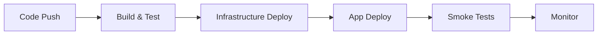
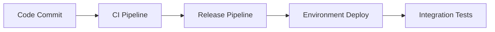

# 🧮 Math Storm Game Suite
## *Sharpen Your Mind with Lightning-Fast Mental Math!* ⚡

<div align="center">


[](https://github.com/lluppesms/math.storm.ghcpa/actions/workflows/4-bicep-build-deploy-both.yml)
[](./Tests/README.md)
[](/.azdo/pipelines/readme.md)
[](/.azure/readme.md)

</div>

---

## 🎯 **What is Math Storm?**

Too often these days we let computers, calculators, and phones do all our mental arithmetic. **Math Storm** helps you reclaim that essential skill! This engaging game challenges you with rapid-fire math problems, building the mental agility that's crucial for success in life and work.

> 💡 **Fun Fact:** This entire application suite was created using **GitHub Copilot Agent** - demonstrating the power of AI-assisted development!

---

## 🏗️ **Architecture Overview**


The application follows a modern cloud-native architecture with multiple client interfaces connecting to a robust Azure backend.

---

## 🚀 **Multiple Ways to Play**

Math Storm offers three distinct interfaces to match your preferred style of interaction:

### 🌐 **Web Application** 
*[📂 src/web](src/web/)*
- **Technology:** Blazor Server with ASP.NET Core
- **Features:** Rich interactive UI, real-time updates, responsive design
- **Perfect for:** Desktop and mobile web browsers
- **Highlights:** Beautiful animations, dark/light themes, progressive difficulty

### 💻 **Console Application** 
*[📂 src/console](src/console/)*
- **Technology:** .NET 8 with Spectre.Console
- **Features:** Colorful terminal interface, ASCII art, cross-platform
- **Perfect for:** Developers, CLI enthusiasts, automation scenarios
- **Highlights:** Beautiful terminal graphics, keyboard shortcuts, performance metrics

### ⚡ **REST API** 
*[📂 src/functions](src/functions/)*
- **Technology:** Azure Functions with OpenAPI documentation
- **Features:** Scalable serverless backend, comprehensive endpoints
- **Perfect for:** Integration with other apps, mobile development, custom clients
- **Highlights:** Auto-scaling, cost-effective, globally distributed

---

## 📁 **Repository Structure**

```
🏠 math.storm.ghcpa/
├── 📂 src/                          # All source code
│   ├── 🌐 web/                      # Blazor Server web application
│   │   ├── MathStorm.Web/           # Main web project
│   │   └── MathStorm.Web.Tests/     # Web application tests
│   ├── 💻 console/                  # Console application
│   │   └── MathStorm.Console/       # Beautiful CLI with Spectre.Console
│   ├── ⚡ functions/                # Azure Functions API
│   │   ├── MathStorm.Functions/     # Serverless backend
│   │   ├── MathStorm.Core/          # Core business logic
│   │   └── MathStorm.Functions.Tests/ # API tests
│   └── 🧩 common/                   # Shared libraries
│       └── MathStorm.Common/        # Models, DTOs, shared services
├── 🏗️ infra/                       # Infrastructure as Code
│   └── Bicep/                       # Azure Bicep templates
├── 🔄 .github/workflows/            # GitHub Actions CI/CD
├── 🔷 .azdo/pipelines/              # Azure DevOps pipelines  
├── ⚡ .azure/                       # Azure Developer CLI config
├── 🧪 Tests/                        # Testing infrastructure
│   ├── playwright/                  # End-to-end browser tests
│   ├── API/                         # API integration tests
│   └── manual/                      # Manual testing scripts
└── 📚 Docs/                         # Documentation and diagrams
```

---

## 🎮 **Core Functions & Services**

### 🎯 **Game Functions**
*[📁 GameFunctions.cs](src/functions/MathStorm.Functions/Functions/GameFunctions.cs)*
- **🎲 GetGame:** Generates new math problems based on difficulty level
- **✅ SubmitAnswer:** Processes player responses and calculates scores
- **⏱️ TimerSync:** Manages real-time game sessions

### 🏆 **Leaderboard Functions**
*[📁 LeaderboardFunctions.cs](src/functions/MathStorm.Functions/Functions/LeaderboardFunctions.cs)*
- **📊 GetLeaderboard:** Retrieves top players globally and by difficulty
- **🎖️ UpdateRankings:** Processes score submissions and ranking updates
- **🏅 GetPlayerStats:** Individual player performance analytics

### 📈 **Results Analysis Functions**
*[📁 ResultsAnalysisFunctions.cs](src/functions/MathStorm.Functions/Functions/ResultsAnalysisFunctions.cs)*
- **📊 GetDetailedStats:** Comprehensive performance breakdowns
- **📈 TrendAnalysis:** Progress tracking over time
- **🎯 DifficultyRecommendations:** AI-powered difficulty suggestions

### 👤 **User Authentication Functions**
*[📁 UserAuthFunctions.cs](src/functions/MathStorm.Functions/Functions/UserAuthFunctions.cs)*
- **🔐 UserAuth:** Secure player authentication
- **👤 ProfileManagement:** Player profile and preferences
- **🔒 SessionManagement:** Secure session handling

### 📊 **Game Results Functions**
*[📁 GameResultsFunctions.cs](src/functions/MathStorm.Functions/Functions/GameResultsFunctions.cs)*
- **💾 StoreResults:** Persists game outcomes and statistics
- **📋 GetGameHistory:** Retrieves player's game history
- **🔍 QueryResults:** Advanced filtering and search capabilities

---

## 🛠️ **Development Workflow**

### 🔄 **Local Development**
1. **Prerequisites:** .NET 8 SDK, Azure Functions Core Tools, Node.js
2. **Setup:** Clone repository → Restore packages → Configure local settings
3. **Run Locally:** Start Azure Functions → Launch web app → Test console app
4. **Development:** Edit code → Run tests → Debug → Iterate

### 🧪 **Testing Strategy**
- **Unit Tests:** xUnit with comprehensive coverage for business logic
- **Integration Tests:** API endpoint testing with realistic scenarios  
- **E2E Tests:** Playwright browser automation for full user workflows
- **Load Tests:** Performance validation under stress conditions

### 📦 **Deployment Pipeline**
The project features **three complete CI/CD implementations** demonstrating different approaches:

#### 🟢 **GitHub Actions** *[📂 .github/workflows](.github/workflows/)*


#### 🔵 **Azure DevOps** *[📂 .azdo/pipelines](.azdo/pipelines/)*


#### ⚡ **Azure Developer CLI** *[📂 .azure](.azure/)*
```bash
azd up  # One command deployment!
```

---

## 🚀 **Deployment Options**

Choose your preferred deployment method:

<table>
<tr>
<td align="center" width="33%">

### 🔧 **GitHub Actions**
*Recommended for GitHub workflows*

[](/.github/workflows-readme.md)

**Features:**
- ✅ Automated on push
- ✅ Matrix builds  
- ✅ Secrets management
- ✅ Environment protection

</td>
<td align="center" width="33%">

### 🔷 **Azure DevOps**
*Enterprise-grade pipelines*

[](/.azdo/pipelines/readme.md)

**Features:**
- ✅ YAML pipelines
- ✅ Approval gates
- ✅ Variable groups
- ✅ Release management

</td>
<td align="center" width="33%">

### ⚡ **Azure Developer CLI**
*One-command deployment*

[](/.azure/readme.md)

**Features:**
- ✅ Single command
- ✅ Environment templates
- ✅ Resource provisioning
- ✅ Configuration management

</td>
</tr>
</table>

---

## 🤖 **AI-Powered Development Story**

This project showcases the incredible potential of **GitHub Copilot Agent** for full-stack development:

### 📊 **AI Generation Statistics**
- **🧠 Code Generated by AI:** 99.9%
- **✋ Manual Tweaks:** < 0.1% (minor text adjustments)
- **🏗️ Architecture:** Designed through AI prompts
- **🎨 UI/UX:** Created via AI-generated Blazor components
- **⚙️ Business Logic:** Implemented through guided AI development

### 🎯 **Demonstration Goals**
1. **🤖 AI Development:** Show how Copilot Agent can create complete applications
2. **🔄 CI/CD Mastery:** Demonstrate comprehensive deployment automation
3. **☁️ Cloud Native:** Modern Azure-based architecture patterns
4. **🧪 Testing Excellence:** Multi-layer testing strategies
5. **📚 Documentation:** AI-generated comprehensive documentation

---

## 🎮 **Console App: Testing Utility & Demonstration**

The console application serves dual purposes:

### 🔧 **Testing Utility**
- **Quick Validation:** Rapid testing of game logic and API endpoints
- **Performance Testing:** Benchmarking and load testing capabilities  
- **Data Generation:** Creating test data and scenarios
- **Debugging Tool:** Isolated testing of specific features

### 📦 **CI/CD Demonstration**
- **Build Process:** Shows compilation of .NET applications
- **Code Signing:** Demonstrates executable signing in pipelines
- **Artifact Creation:** Example of distributable package creation
- **Cross-Platform:** Multi-OS build and deployment examples

---

## 🔍 **Key Technologies Demonstrated**

<div align="center">

| Category | Technologies |
|----------|-------------|
| **🖥️ Frontend** | Blazor Server, HTML5, CSS3, JavaScript, Bootstrap |
| **🔧 Backend** | .NET 8, Azure Functions, ASP.NET Core |
| **☁️ Cloud** | Azure App Service, Azure Functions, Azure Storage |
| **📊 Data** | Azure Table Storage, Redis Cache, Blob Storage |
| **🧪 Testing** | xUnit, Playwright, Integration Tests, Load Tests |
| **🚀 DevOps** | GitHub Actions, Azure DevOps, Azure CLI (azd) |
| **🏗️ Infrastructure** | Bicep, ARM Templates, Infrastructure as Code |
| **🔒 Security** | Azure Key Vault, Managed Identity, HTTPS |

</div>

---

## 🏃‍♂️ **Quick Start**

### 1️⃣ **Local Development**
```bash
# Clone the repository
git clone https://github.com/lluppesms/math.storm.ghcpa.git
cd math.storm.ghcpa

# Restore dependencies
dotnet restore src/web/MathStorm.Web.sln
dotnet restore src/functions/MathStorm.Functions.sln

# Run the web app
cd src/web/MathStorm.Web
dotnet run

# Run the console app  
cd ../../console/MathStorm.Console
dotnet run

# Run the functions locally
cd ../../functions/MathStorm.Functions
func start
```

### 2️⃣ **Deploy to Azure**
```bash
# Option 1: Azure Developer CLI (Fastest)
azd up

# Option 2: GitHub Actions (Push to main branch)
git push origin main

# Option 3: Azure DevOps (Configure pipeline)
# See .azdo/pipelines/readme.md
```

---

## 📈 **Monitoring & Analytics**

- **📊 Application Insights:** Real-time performance monitoring
- **🚨 Alert Rules:** Automated issue detection and notification  
- **📈 Custom Dashboards:** Business metrics and KPI tracking
- **🔍 Log Analytics:** Comprehensive logging and troubleshooting
- **⚡ Performance Counters:** Response times, throughput, error rates

---

## 🤝 **Contributing**

We welcome contributions! This project is perfect for demonstrating:

- 🤖 **AI-Assisted Development** techniques
- 🔄 **Modern CI/CD** pipeline patterns  
- ☁️ **Cloud-Native** architecture principles
- 🧪 **Comprehensive Testing** strategies

See our [Contributing Guidelines](./CONTRIBUTING.md) for details.

---

## 📚 **Additional Resources**

<div align="center">

[](https://vscode.dev/github/lluppesms/math.storm.ghcpa)
[](./Docs/)
[](./Tests/API/)
[](./Tests/README.md)

</div>

---

## 📄 **License**

This project is licensed under the [MIT License](./LICENSE) - feel free to use it for learning, demonstrations, or building your own math games!

---

<div align="center">

**Made with 💖 and 🤖 by [GitHub Copilot Agent](https://github.blog/ai-and-ml/github-copilot/agent-mode-101-all-about-github-copilots-powerful-mode/)**

*Showcasing the future of AI-assisted development*

---

⭐ **Star this repo if you found it helpful!** ⭐

</div>
