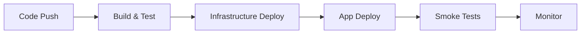
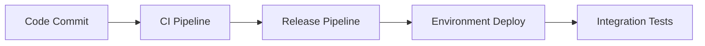

# 🧮 Math Storm Game Suite
## *Sharpen Your Mind with Lightning-Fast Mental Math!* ⚡

<div align="center">


[](https://github.com/lluppesms/math.storm.ghcpa/actions/workflows/4-bicep-build-deploy-both.yml)
[](./Tests/README.md)
[](/.azdo/pipelines/readme.md)
[](/.azure/readme.md)

</div>

---

## 🎯 **What is Math Storm?**

Too often these days we let computers, calculators, and phones do all our mental arithmetic. **Math Storm** helps you reclaim that essential skill! This engaging game challenges you with rapid-fire math problems, building the mental agility that's crucial for success in life and work.

## ⚡ **Repository Goal**

This repository is an example of deploying a .NET 8 application suite into Azure. This project is intended to be a good example of using Infrastructure as Code (IaC) to deploy and manage the Azure resources, utilizing [Bicep](https://learn.microsoft.com/en-us/azure/azure-resource-manager/bicep/overview) to deploy Azure resources declaratively.


## 🔍 **Key Technologies Demonstrated**

| Category | Technologies |
|----------|-------------|
| **🖥️ Frontend** | Blazor Server, HTML5, CSS3, JavaScript, Bootstrap |
| **🔧 Backend** | .NET 8, Azure Functions, ASP.NET Core |
| **☁️ Cloud** | Azure App Service, Azure Functions, Azure Storage |
| **📊 Data** | Azure Table Storage, Cosmos Database |
| **🧪 Testing** | xUnit, Playwright, Integration Tests |
| **🚀 DevOps** | GitHub Actions, Azure DevOps, Azure CLI (azd) |
| **🏗️ Infrastructure** | Bicep, ARM Templates, Infrastructure as Code |
| **🔒 Security** | Azure Key Vault, Managed Identity, HTTPS |

## 🧠 **Author and Origin**

💡 **Fun Fact:** This project showcases the incredible potential of [GitHub Copilot Agent](https://github.blog/ai-and-ml/github-copilot/agent-mode-101-all-about-github-copilots-powerful-mode/) for full-stack development: The source code for this game was almost entirely coded using the Agent Mode (on GitHub and in VS Code), guided by prompts and instructions from the developer. A few lines were tweaked manually because of it was easier than writing a prompt (like the About page text), but the 99.9% of the code was generated by the AI.

#### 📊 **AI Generation Statistics**
- **🧠 Code Generated by AI:** 99.9%
- **✋ Manual Tweaks:** < 0.1% (minor text adjustments)
- **🏗️ Architecture:** Designed through AI prompts
- **🎨 UI/UX:** Created via AI-generated Blazor components
- **⚙️ Business Logic:** Implemented through guided AI development

#### 🎯 **Demonstration Goals**
1. **🤖 AI Development:** Show how Copilot Agent can create complete applications
2. **🔄 CI/CD Mastery:** Demonstrate comprehensive deployment automation
3. **☁️ Cloud Native:** Modern Azure-based architecture patterns
4. **🧪 Testing Excellence:** Multi-layer testing strategies
5. **📚 Documentation:** AI-generated comprehensive documentation

## 🏗️ **Architecture Overview**


The application follows a modern cloud-native architecture with multiple client interfaces connecting to a robust Azure backend.

## 🚀 **Multiple Ways to Play**

Math Storm offers two distinct interfaces to match your preferred style of interaction:

### 🌐 **Web Application** 
*[📂 src/web](src/web/)*
- **Technology:** Blazor Server with ASP.NET Core
- **Features:** Rich interactive UI, real-time updates, responsive design
- **Perfect for:** Desktop and mobile web browsers
- **Highlights:** Beautiful animations, dark/light themes, progressive difficulty

### 💻 **Console Application** 
*[📂 src/console](src/console/)*
- **Technology:** .NET 8 with Spectre.Console
- **Features:** Colorful terminal interface, ASCII art, cross-platform
- **Perfect for:** Developers, CLI enthusiasts, automation scenarios
- **Highlights:** Beautiful terminal graphics, keyboard shortcuts, performance metrics

## 🛠️ **Development Workflow**

#### 🔄 **Local Development**
1. **Prerequisites:** .NET 8 SDK, Azure Functions Core Tools, Cosmos Emulator
2. **Setup:** Clone repository → Restore packages → Configure local settings
3. **Run Locally:** Start Azure Functions → Launch web app → Test console app
4. **Development:** Edit code → Run tests → Debug → Iterate

#### 🧪 **Testing Strategy**
- **Unit Tests:** xUnit with comprehensive coverage for business logic
- **Integration Tests:** API endpoint testing with realistic scenarios  
- **E2E Tests:** Playwright browser automation for full user workflows
- **Load Tests:** Performance validation under stress conditions

## 🚀 **Deployment Options**
The project features **three complete CI/CD implementations** demonstrating different approaches - choose your preferred deployment method:

<table>
<tr>
<td width="33%">

### 🔧 **GitHub Actions**
*Recommended for GitHub*

[](/.github/workflows-readme.md)

**Features:**
- ✅ YML&nbsp;Pipelines
- ✅ Matrix&nbsp;builds
- ✅ Secrets&nbsp;management
- ✅ Environment&nbsp;protection

</td>
<td width="33%">

### 🔷 **Azure DevOps**
*Enterprise-grade pipelines*

[](/.azdo/pipelines/readme.md)

**Features:**
- ✅ YML&nbsp;pipelines
- ✅ Approval&nbsp;gates
- ✅ Variable&nbsp;groups
- ✅ Release&nbsp;management

</td>
<td width="33%">

### ⚡ **Azure Developer CLI**
*One-command deployment*

[](/.azure/readme.md)

**Features:**
- ✅ Single command
- ✅ Environment&nbsp;templates
- ✅ Resource&nbsp;provisioning
- ✅ Configuration&nbsp;management

</td>
</tr>
</table>


#### 🟢 **GitHub Actions** *[📂 .github/workflows](.github/workflows/)*


#### 🔵 **Azure DevOps** *[📂 .azdo/pipelines](.azdo/pipelines/)*


#### ⚡ **Azure Developer CLI** *[📂 .azure](.azure/)*
```bash
azd up  # One command deployment!
```


## 🎮 **Console App: Testing Utility & Demonstration**

The console application serves dual purposes:

### 🔧 **Testing Utility**
- **Quick Validation:** Rapid testing of game logic and API endpoints
- **Performance Testing:** Benchmarking and load testing capabilities  
- **Data Generation:** Creating test data and scenarios
- **Debugging Tool:** Isolated testing of specific features

### 📦 **CI/CD Demonstration**
- **Build Process:** Shows compilation of .NET applications
- **Code Signing:** Demonstrates executable signing in pipelines
- **Artifact Creation:** Example of distributable package creation
- **Cross-Platform:** Multi-OS build and deployment examples

---

## 🏃‍♂️ **Quick Start**

### 1️⃣ **Local Development**
```bash
# Clone the repository
git clone https://github.com/lluppesms/math.storm.ghcpa.git
cd math.storm.ghcpa

# Restore dependencies
dotnet restore src/web/MathStorm.Web.sln
dotnet restore src/functions/MathStorm.Functions.sln

# Run the functions locally
cd src/functions/MathStorm.Functions
dotnet run

# Run the web app
cd ../../web/MathStorm.Web
func start

# Run the console app  
cd ../../console/MathStorm.Console
dotnet run
```

### 2️⃣ **Deploy to Azure**
```bash
# Option 1: Azure Developer CLI (Fastest)
azd up

# Option 2: GitHub Actions (Push to main branch)
git push origin main

# Option 3: Azure DevOps (Configure pipeline)
# See .azdo/pipelines/readme.md
```

---

## 📈 **Monitoring & Analytics**

- **📊 Application Insights:** Real-time performance monitoring
- **🚨 Alert Rules:** Automated issue detection and notification  
- **📈 Custom Dashboards:** Business metrics and KPI tracking
- **🔍 Log Analytics:** Comprehensive logging and troubleshooting
- **⚡ Performance Counters:** Response times, throughput, error rates

---

## 📚 **Additional Resources**

<div align="center">

[](https://vscode.dev/github/lluppesms/math.storm.ghcpa)
[](./Docs/)
[](./Tests/API/)
[](./Tests/README.md)

</div>

---

## 📄 **License**

This project is licensed under the [MIT License](./LICENSE) - feel free to use it for learning, demonstrations, or building your own math games!

---

<div align="center">

**Made with 💖 and 🤖 by [GitHub Copilot Agent](https://github.blog/ai-and-ml/github-copilot/agent-mode-101-all-about-github-copilots-powerful-mode/)**

*Showcasing the future of AI-assisted development*

---

⭐ **Star this repo if you found it helpful!** ⭐

</div>
